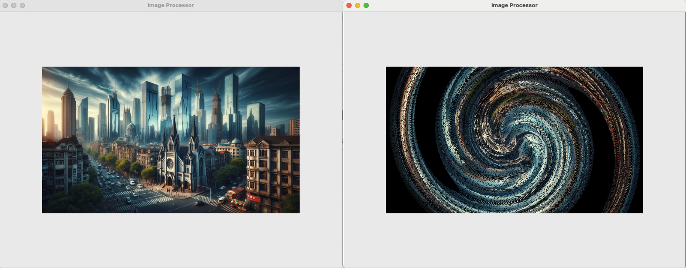

# Python-Image-Processor
Process your images with Image Processor. You can use a command line interface or a graphical user interface, our tool will suit your needs.
Apply a range of image filters including Swirl, Erode/Dilate, Contrast, Brightness and Threshold to enhance your images. Save and apply filters with ease for quick adjustments and refinements.

You can use various Image Filters like:
- Swirl
- Erode / Dilate
- Contrast
- Brightness
- Threshold

## Usage
You can use it via CMD or Graphical Interface.
**CMD:
**
python3 filtertool.py filter_type blur --value 4 --area x_min, x_max, y_min, y_max --original_image example.png

**Graphical Interface:
**
python3 graphical_interface.py

## Installation Guide
You must install follwing Libraries/Python version
- click (version 8.1.7)
- pillow (version 10.3.0)
- python (version 3.12)
